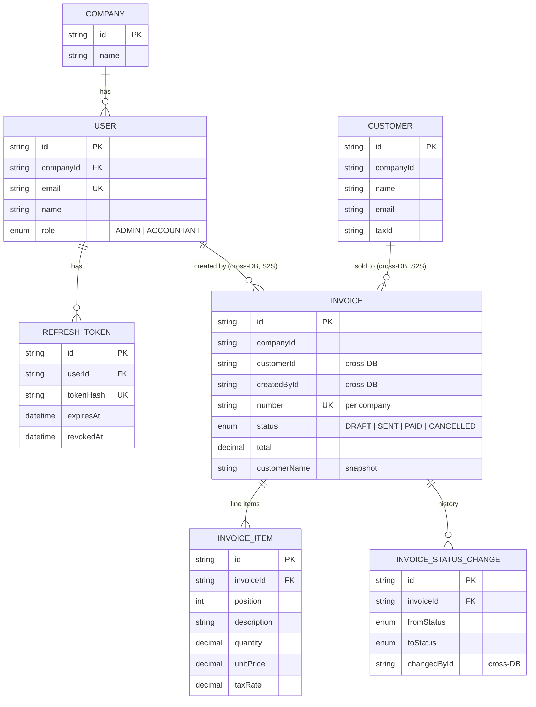

# SLM ERP

A small invoicing system: 4 NestJS APIs + 3 Next.js frontends, deployed
independently, sharing one typed contract kernel and one end-to-end test that
boots the whole fleet.

## Quick start (~5 minutes)

1. `pnpm install`
2. `docker compose up -d` — one Postgres on port 5434
3. `cp .env.example .env`
4. `pnpm db:prepare` — migrations + seed
5. `pnpm dev` — whole fleet behind one origin at **http://localhost:3000**

Sign in with the seeded accounts:

| Role | Email | Password |
| ---- | ----- | -------- |
| Admin | `admin@slm.local` | `admin123` |
| Accountant | `accountant@slm.local` | `accountant123` |

## Data model

Four databases, one per service (`slm_auth`, `slm_customers`, `slm_invoices`).
`api-dashboard` is a read-aggregate with no database. Foreign keys only exist
inside a database; the dashed links are cross-service references resolved over
S2S (the invoice stores a customer snapshot, so a deleted customer never
orphans an invoice).



## How it's wired

| Layer | Pieces |
| ----- | ------ |
| Backend | `@repo/api-auth` (users + tokens), `@repo/api-customers`, `@repo/api-invoices`, `@repo/api-dashboard` (read-aggregate) |
| Frontend | `@repo/zone-dashboard` (login + users admin), `@repo/zone-customers`, `@repo/zone-invoices` |
| Shared kernel | `@repo/contracts` (typed boundaries), `@repo/common`, `@repo/ui`, `@repo/web-shared` (same-origin API + session), `@repo/web-shell` |

Everything is synchronous REST. The browser talks to **one same-origin
`/api/v1`**; an edge (Vercel rewrites in prod, each zone's `next.config` in
dev) proxies each prefix to its service. Services talk to each other over S2S
using a shared-secret JWT plus internal API keys. Each service owns its
database and an idempotent seed.

`pnpm dev` maps the single origin exactly like the Vercel edge does:

| Origin :3000 path | Backed by |
| ----------------- | --------- |
| `/dashboard`, `/login`, `/users`, `/` | zone-dashboard (:3004) |
| `/customers...` | zone-customers (:3001, `basePath /customers`) |
| `/invoices...` | zone-invoices (:3002, `basePath /invoices`) |
| `/api/v1/{auth,users,customers,invoices,dashboard}/*` | API services (:4001–:4004) |

Skip the proxy with `pnpm dev:apps`, or run one piece:

```sh
pnpm --filter @repo/api-invoices dev     # one API
pnpm --filter @repo/zone-invoices dev    # one zone
```

API docs (Swagger): `http://localhost:4001/api/v1/docs` (and the other service
ports).

## Decisions and assumptions

Both splits (services and zones) were made before any scale justified them.
The point is seams: each piece can be deployed, tested, and handed to a team on
its own. The costs below are what you inherit.

### Microfrontends

| Decision | Assumption / why | Cost it carries |
| -------- | ---------------- | --------------- |
| 3 separate Next.js apps, not one app | Independent deploys and clean team seams; zones ship on their own schedule | Shell + UI bundle rebuilt per zone (3 copies of `web-shell`) |
| Path-routed on **one origin** (`/customers`, `/invoices`), not subdomains | One cookie, one session, no CORS — the shared session survives zone-to-zone navigation | Edge rewrites are dumb: RSC fetches 404 at bare zone paths (list lives at `/customers/list`), and slash handling ping-pongs (fixed by one no-trailing-slash convention everywhere) |
| `basePath` on each zone app | Dev and prod describe the same topology — `next.config` mirrors `vercel.json`, no environment surprises | BasePath footguns: double-prefixed hrefs, `usePathname()` stripping the zone base |
| Zone nav bases are env-driven (`NEXT_PUBLIC_*_URL`) | The nav must know where each zone lives without hardcoding per environment | Every deploy must keep env vars consistent across the 3 projects |
| Hand-rolled `vercel.json` edge rewrites, not the managed **Vercel Microfrontends** group | Hobby includes only 2 microfrontend projects; a 3rd costs $250/mo on Pro. The manual pattern counts against no microfrontend limits and is free | Rewrite lists are hand-maintained and must stay in sync with the fleet (and the edge cannot serve RSC at bare zone paths — the `/list` workaround) |

Not chosen: Module Federation and iframes. Both add runtime complexity and a
loading tax; path-routing buys the same isolation with plain full-page loads
between zones.

### Microservices

| Decision | Assumption / why | Cost it carries |
| -------- | ---------------- | --------------- |
| 4 NestJS services, one database each | Independent secrets, migrations, and scaling per domain | Cross-service identity is logical, not FK-enforced; nothing joins across databases |
| Invoice stores a customer **snapshot** (name + taxId) | Customers are fetched over S2S at create time; a deleted customer must not orphan invoices, and reads stay within one DB | Snapshot can drift from the live customer record |
| S2S via shared-secret JWT + internal API keys | Lightweight auth between services without a service mesh or network policy | One compromised secret spans every service; key rotation is manual |
| Same-origin `/api/v1/{prefix}/*` proxied by the edge | One API base URL for the browser, no per-zone API envs, no CORS anywhere | Every deploy keeps the rewrite list in sync with the fleet |
| `api-dashboard` is a read-aggregate with no DB | Reporting reads across domains; a materialized view is overkill at this size | Summaries can lag a write by a request round-trip |
| Idempotent seeds + `prisma migrate deploy` on release | Re-runs on boot must be safe and repeatable | Migration mistakes surface at deploy time, not in CI |

Not chosen: an event bus / outbox (nothing needs replay yet) and a shared
database (would couple the services' schemas and secrets).

## Tests

```sh
pnpm typecheck && pnpm lint && pnpm test   # fleet-wide gates + unit tests
pnpm test:e2e                              # per-service e2e suites
pnpm test:e2e:cross                        # whole fleet, *_test databases
```

`test:e2e:cross` is the one story that matters end to end: log in → list
customers → create and send a draft invoice (customer snapshot fetched over
S2S) → confirm the dashboard summary reflects it. Zone-level frontend tests are
intentionally none — typecheck plus the fleet e2e cover the contract.

## Deployment

**Backends → Render** (4 web services from `render.yaml`, Docker runtime, free
plan — first requests cold-start). Each release runs `prisma migrate deploy` +
its idempotent seed, then boots.

| Service | Swagger |
| ------- | ------- |
| slm-api-auth | https://slm-api-auth.onrender.com/api/v1/docs |
| slm-api-customers | https://slm-api-customers.onrender.com/api/v1/docs |
| slm-api-invoices | https://slm-api-invoices.onrender.com/api/v1/docs |
| slm-api-dashboard | https://slm-api-dashboard.onrender.com/api/v1/docs |

Health: `/api/v1/health` on every service.

**Databases → Neon** (free) — one Postgres per service, created in the Neon
console; connection strings live in the Render dashboard (never the repo).

**Frontends → Vercel** (one project per zone, auto-deploys from `main`):

- `vercel.json` rewrites `/api/v1/{prefix}/*` to the matching Render service;
  `users → auth` is configured only on the dashboard zone (it hosts users
  admin). No per-zone API envs — the API is always same-origin `/api/v1`.
- Zone nav bases are env-driven (`@repo/web-shell`): set
  `NEXT_PUBLIC_DASHBOARD_URL`, `NEXT_PUBLIC_CUSTOMERS_URL`,
  `NEXT_PUBLIC_INVOICES_URL` to the shared-domain URLs.
- The three zones form a **Vercel Microfrontends** group: edge path-routing on
  one domain, configured in the Vercel dashboard.

CI runs build, lint, typecheck, unit + e2e on every PR and push to `main`.

## Repo map

```
apps/
  api-auth|api-customers|api-invoices|api-dashboard/   NestJS services (+ prisma/)
  zone-dashboard|zone-customers|zone-invoices/         Next.js 16 apps
libs/common/                                           shared backend helpers (money, guards, S2S)
packages/
  contracts/  typed API boundaries (DTOs + S2S contracts)
  ui/         shadcn-style design system
  web-shared/ same-origin API client + shared session
  web-shell/  shared nav/shell + gates
e2e/                                                   cross-fleet e2e
```
